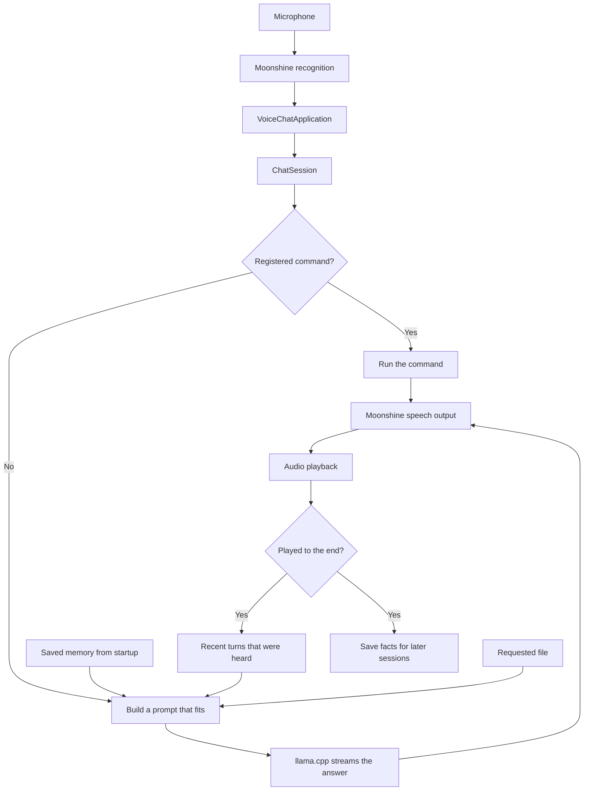

# Architecture

This document explains HOW the code works.

The local backend uses three models: Moonshine turns speech into text, a GGUF chat model in llama.cpp writes the answer, and Moonshine turns the answer into speech. Speech starts while the model is still writing. Recognition keeps running during playback, so the user can interrupt.



## Modules

`cli.py` creates all parts and connects them. `voice.py` talks to the conversation only through three `ChatSession` methods: `stream_reply`, `cancel_current_reply`, and `finalize_turn`. `ChatSession` talks to the model only through the `StreamingChatModel` interface in `contracts.py`. The tests replace the model, speech, and audio at these points.

| Module | What it does |
| --- | --- |
| `config.py`, `cli.py` | Read the options, create all parts, start and stop the app |
| `startup_menu.py`, `system_prompts.py`, `audio_devices.py` | Startup menu, prompt files, choice of microphone and speaker |
| `echo_cancellation.py`, `pulse_audio.py` | Echo cancellation on Linux through PulseAudio or PipeWire |
| `voice.py` | Runs a spoken turn: wait until the user is done, answer, speak, handle interruptions |
| `moonshine.py` | Moonshine glue: speech output that stops quickly, recognition events |
| `speech_text.py` | Detects the assistant's own voice in the microphone, starts speaking the first part early |
| `chat.py` | The conversation: commands, model calls, history |
| `prompts.py` | Builds the prompt so it fits into the model's context |
| `llama.py` | Wraps llama.cpp: load the model, count tokens, stream text, cancel |
| `commands.py` | Spoken commands and their phrases |
| `file_tools.py` | Reads text files from one folder |
| `online.py` | Weather, news, and web search for "please check online" |
| `memory.py` | Saved memory: what to remember, limits, JSON file |
| `realtime.py`, `audio.py` | OpenAI Realtime backend and its audio playback |
| `reliability.py`, `metrics.py` | Time limits while a turn runs, timings for `--latency` |

## One local turn

1. Moonshine reports that a line of speech is finished. `VoiceChatApplication.submit_transcript()` stops an answer that is still playing and puts the text into a queue.
2. The conversation worker waits until the user has been quiet for `--end-of-turn-delay` (1 second by default). Lines that finish during this wait are added to the same question.
3. `ChatSession.stream_reply()` checks whether the text is a command. A command answers directly. Everything else goes to the model.
4. `PromptBuilder` puts together the system prompt, saved memory, recent turns, an optional file, and the question, and cuts what doesn't fit ([prompt priority](decisions.md)).
5. The model streams its answer. `voice.py` prints each piece and passes it to Moonshine, which turns it into speech. A playback thread sends the audio to the speaker.
6. When playback finishes, `voice.py` calls `finalize_turn(True)`, and the turn stays in history. If the answer was interrupted or failed, `finalize_turn(False)` removes the question and the answer.

## Interruption

When the user starts talking during an answer, `voice.py` waits for the first words from the recognizer. A cough or another sound without words changes nothing. If the model hasn't written anything yet, the first words cancel the answer. Once the assistant is speaking, the words cancel the answer unless they match what the assistant is saying, because then they are probably its own voice coming from the speaker ([details](decisions.md)). If the user keeps talking within 2 seconds after an answer started (`_CONTINUATION_SECONDS`) and before any of it could be heard, the question goes back into the queue and is joined with the new words.

Cancelling has two steps, so the recognizer never waits. The recognition callback only signals the stop to the turn, the model, and playback, which falls silent within 40 ms. A cleanup thread then stops the speech output and waits for Moonshine's threads. The next turn starts only after this cleanup, so two answers never play at once.

| Thread | Responsible for |
| --- | --- |
| Recognition callbacks | Speech events, queuing transcripts, stop signals |
| Conversation worker | Waiting for the end of the turn, `ChatSession`, commands, prompts, model output, finishing the turn |
| Speech and playback threads | Turning text into audio and playing it |
| Cleanup thread | Stopping the speech output after an interruption |

## Memory

| Kind | What it holds | How long |
| --- | --- | --- |
| History | The full text of the last 8 turns, fewer if the prompt gets too long | Until the app stops |
| Saved memory | Up to 24 facts the user stated (names, preferences, decisions, plans) and the last topic | Across restarts |

A turn stays in history only if its answer was played to the end. Only model answers that were played completely update the saved memory; command replies never do. The saved memory is loaded once at startup and stored as a JSON file. A broken file is reported and left unchanged until the user clears it with `--clear-memory` or in the startup menu.

## Realtime backend

`--backend realtime` replaces the local models with an OpenAI Realtime session over a WebSocket. `realtime.py` sends the microphone audio and handles the server's events, and `audio.py` plays the answer. The app asks for an answer only after the transcript of the user's speech has arrived, so "please check online" can run `OnlineLookup` first. The model can call one local function, which reads `files/goodnight_story.txt`. This backend doesn't use `ChatSession`, the saved memory, spoken commands, or the file reader. The reasons are in [Realtime backend](decisions.md).

## Adding features

| To add | Change | Tests |
| --- | --- | --- |
| A spoken command | `CommandRegistry.register()` in `cli._run_local()` | `tests/test_commands.py` |
| Another chat model | Implement `StreamingChatModel` | `tests/test_chat.py` |
| Other context for a question | Implement `RequestContextTool` and add a matching rule to the prompt | `tests/test_file_tools.py`, `tests/test_prompts.py` |
| Another memory store | Implement `ConversationMemory` | `tests/test_memory.py` |
| Changes to speech | `voice.py`, `moonshine.py` | `tests/test_voice.py`, `tests/test_moonshine.py` |

The conversation part runs without models or audio devices. Install the package or set `PYTHONPATH=src`, then run:

```python
from offline_voice_chat.chat import ChatSession
from offline_voice_chat.commands import Command, default_commands


class FixedAnswerModel:
    """Stands in for llama.cpp and returns the answer in pieces."""

    prompt_budget = 3584

    def count_tokens(self, text):
        return len(text.encode("utf-8"))

    def prepare_reply(self):
        pass

    def cancel_current_reply(self):
        pass

    def stream_reply(self, messages):
        yield "Stars twinkle because "
        yield "moving air bends their light."


session = ChatSession(
    FixedAnswerModel(), system_prompt="Give short answers.", max_history_turns=2
)
session.commands = default_commands(reset_conversation=session.reset_conversation)
session.commands.register(
    Command(
        name="ping",
        phrases=("ping",),
        description="check that commands work",
        execute=lambda: "Pong.",
    )
)

print("".join(session.stream_reply("Why do stars twinkle?")))  # From the model.
session.finalize_turn(True)  # Played in full, so the turn stays in history.
print("".join(session.stream_reply("Ping!")))  # From the command, without the model.
session.finalize_turn(True)
print(len(session.history))  # 4: two questions and two answers.
```

Command handlers run on the conversation worker, so a slow handler delays every turn after it. A command marked `blocking`, like the online lookup, runs on its own thread instead, and a cancelled turn doesn't wait for it. Such a handler must not change the conversation state, because it can still be running when the next turn starts. A command runs before its reply is spoken, so interrupting the reply doesn't undo it.
